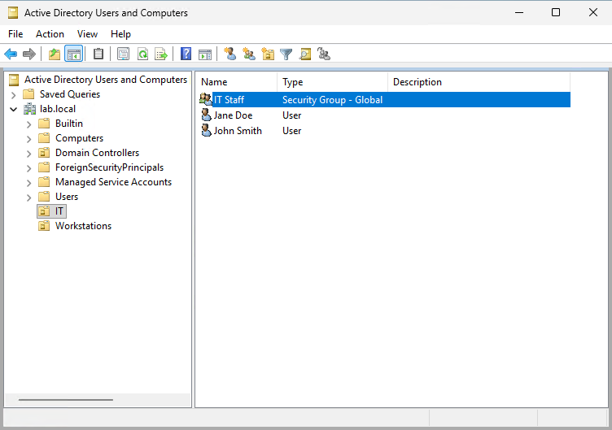
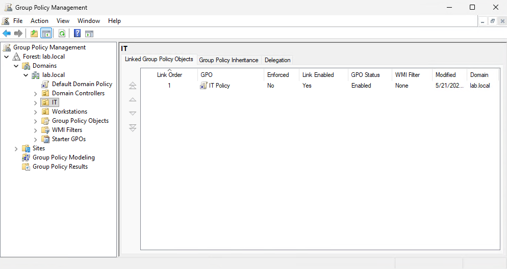
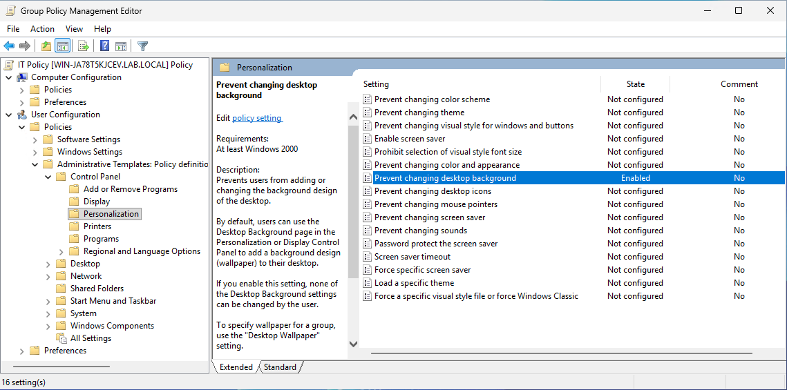
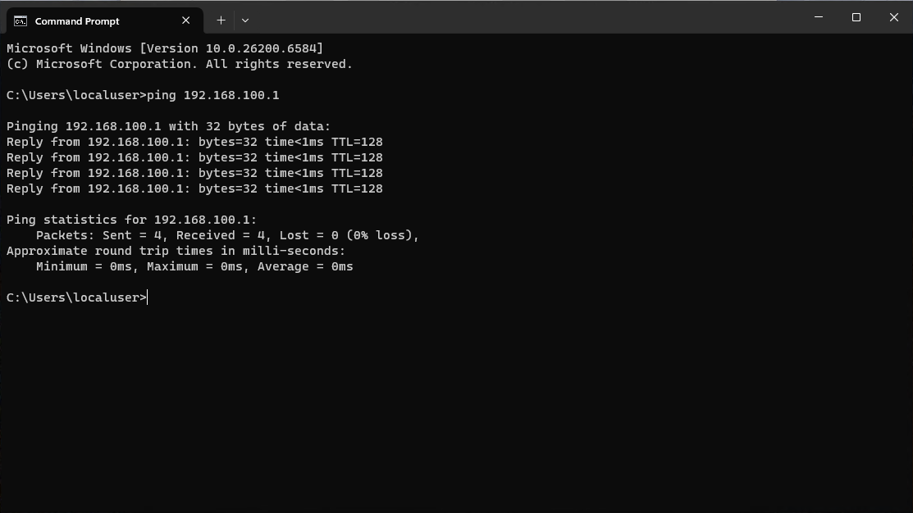
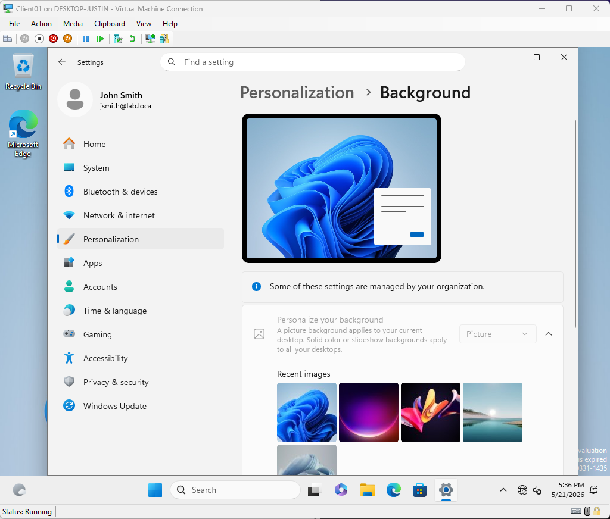
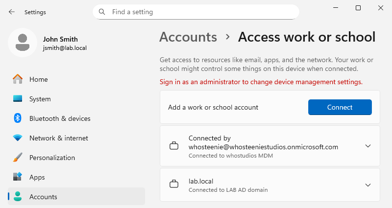
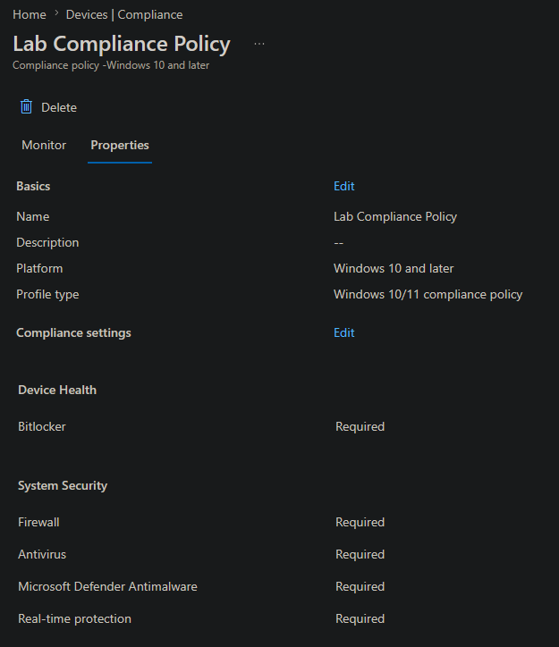
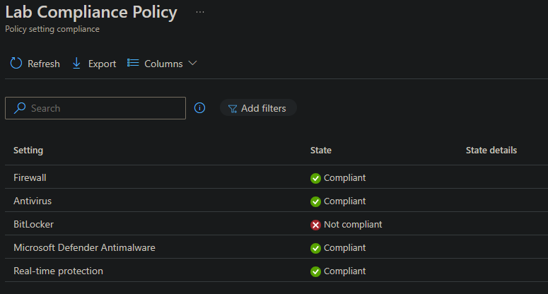

# Active Directory Home Lab

## Overview

Home lab built using Hyper-V on Windows 11 Pro to practice Active Directory,
user management, group policy, domain administration, and Microsoft Intune
endpoint management.

## Environment

Host: Windows 11 Pro, 32GB DDR5  
Hypervisor: Hyper-V  
Domain Controller: Windows Server 2025 Standard Evaluation  
Client VMs: Windows 11 Enterprise Evaluation  

## Topology

DC01 - Windows Server 2025 (Domain Controller, DNS Server)  
  IP: 192.168.100.1 (internal) + DHCP (external, internet access)  
  Domain: lab.local  

Client01 - Windows 11 Enterprise (domain joined, Intune enrolled)  
  IP: 192.168.100.10 (internal) + DHCP (external, internet access)  

---

## Domain Controller Setup

Spun up a Windows Server 2025 VM in Hyper-V using an internal virtual switch
to keep lab traffic isolated from the host network. Installed the AD DS role
and promoted the server to a Domain Controller for a new forest at lab.local.
Set a static IP of 192.168.100.1 with DNS pointing to itself (127.0.0.1) since
it acts as the DNS server for the domain.

Both VMs were later given a second network adapter connected to an external
virtual switch to provide internet access for cloud service integration.

---

## Active Directory Configuration

### Organizational Units

Created two OUs at the domain root to keep users and computers separate,
making it easier to apply Group Policy independently to each.

- IT
- Workstations

### Users and Groups

Created two user accounts in the IT OU for testing and policy verification.

- jsmith (John Smith)
- jdoe (Jane Doe)

Both accounts were added to a Global Security Group called IT Staff.
Grouping users this way makes permission management cleaner since you
assign access to the group rather than individual accounts.

  

<em>Users and IT Staff group inside the IT OU</em>

### Group Policy

Created a GPO called IT Policy and linked it to the IT OU. Configured a policy
to prevent users from changing the desktop background. The setting is under
User Configuration, Policies, Administrative Templates, Control Panel,
Personalization, Prevent changing desktop background.

  

<em>IT Policy linked to the IT OU in Group Policy Management</em>

  

<em>GPO setting configured to prevent users from changing the desktop background</em>

---

## Client VM Setup

Spun up a Windows 11 Enterprise VM in Hyper-V on the same internal switch.
Set a static IP of 192.168.100.10 with the DC as the default gateway and DNS
server. Verified connectivity to DC01 via ping before joining the domain.

  

<em>Successful ping from Client01 to DC01 confirming network connectivity</em>

Joined Client01 to lab.local through System Properties using domain admin
credentials. After rebooting, logged in as LAB\jsmith and confirmed the
domain user profile was created and Group Policy applied correctly.

  

<em>jsmith logged in as a domain user with the background policy enforced</em>

The background settings page shows "Some of these settings are managed
by your organization" and the options are grayed out, confirming the
GPO is applying as expected.

---

## Microsoft Intune Enrollment

Extended the lab to include Microsoft Intune for cloud-based endpoint
management, reflecting how modern enterprise environments manage devices
alongside on-premises Active Directory in a hybrid model.

Set up a Microsoft Intune trial tenant and enrolled Client01 using the
manual MDM enrollment path through Settings. The domain admin account
performed the enrollment since end users do not have device management
rights, consistent with how enterprise IT handles device provisioning.

  

<em>Client01 enrolled in Intune MDM alongside the existing AD domain join</em>

### Compliance Policy

Created a compliance policy called Lab Compliance Policy targeting Windows
10 and later devices. The policy enforces the following security requirements:

- BitLocker encryption required
- Firewall enabled
- Antivirus enabled
- Microsoft Defender Antimalware enabled
- Real-time protection enabled

  

<em>Lab Compliance Policy configured in Intune</em>

After syncing Client01, the device evaluated as non-compliant specifically
on BitLocker. This is expected since Hyper-V VMs do not have a TPM chip by
default, which BitLocker requires. All other policy settings evaluated as
compliant. In a production environment the remediation would be to either
enable a virtual TPM on the VM, encrypt the drive, or create a compliance
exception for lab and virtual machines.

  

<em>Policy setting evaluation showing BitLocker non-compliant as it is not enabled on the device, all other settings compliant</em>

---

## What's Next

- Deploy an application to Client01 via Intune
- Create additional GPOs (password policy, drive mapping, software restriction)
- Add PowerShell scripts for AD user and group administration
- Move Client01 computer account into the Workstations OU
- Practice user account management (disable, unlock, reset password)
